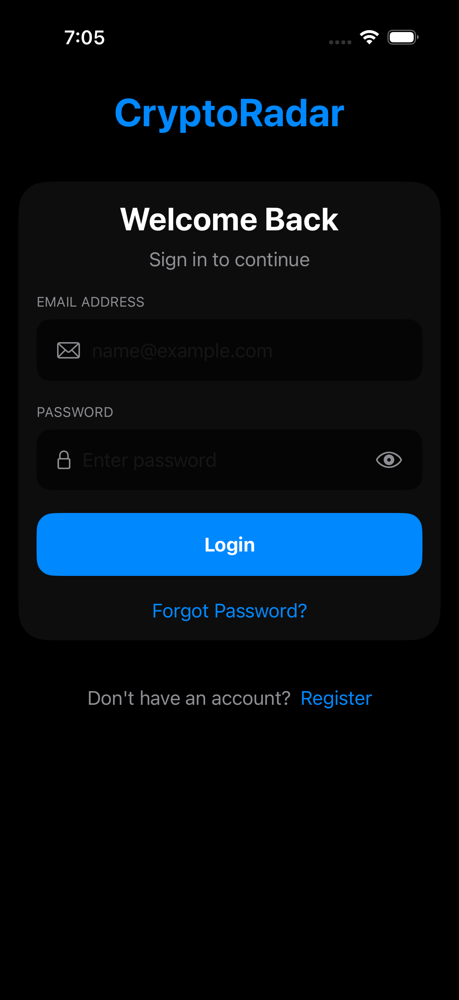
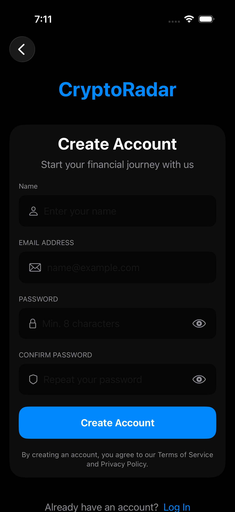
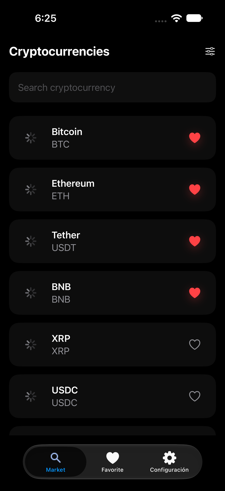
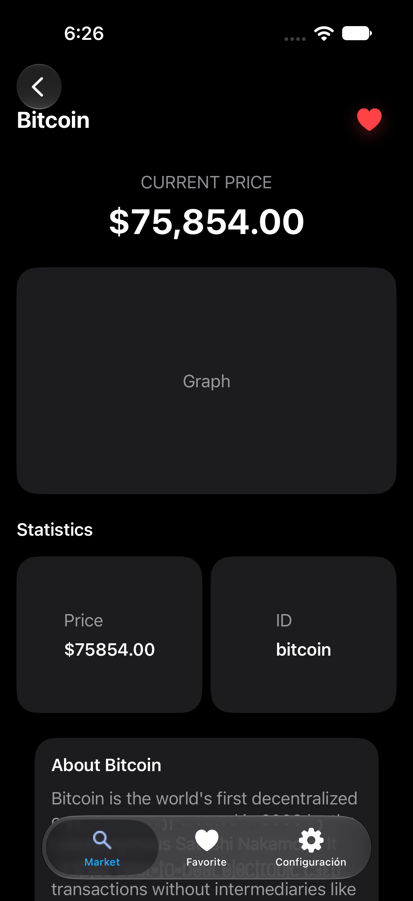
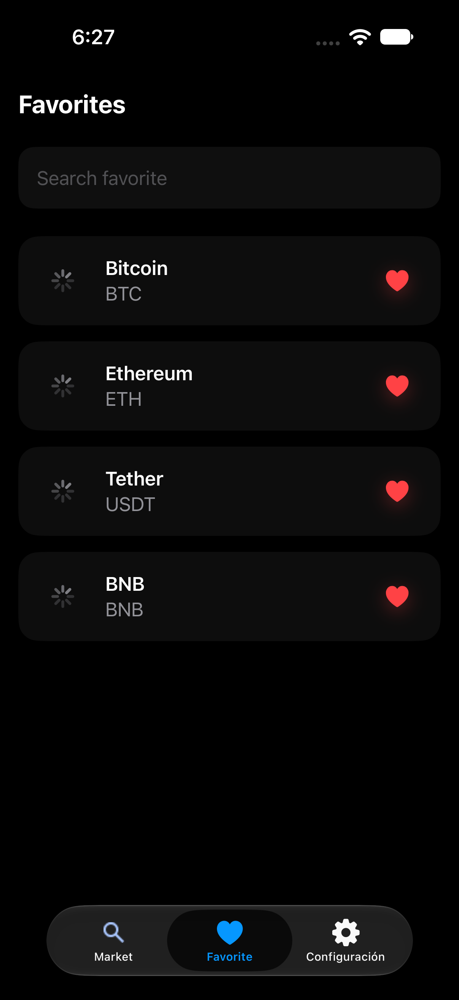
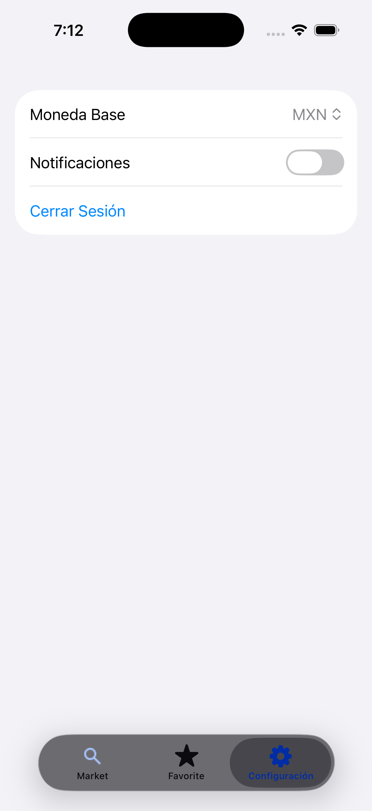

# 🚀 CryptoRadar

CryptoRadar es una aplicación iOS desarrollada en SwiftUI que permite visualizar el mercado de criptomonedas utilizando la API pública de CoinGecko.
La aplicación permite explorar criptomonedas, consultar información detallada, guardar favoritos y acceder mediante Deep Links.
---

# 📱 Funcionalidades

- Login y Registro de usuario
- Listado de criptomonedas
- Detalle de cada criptomoneda
- Agregar y eliminar favoritos
- Persistencia local mediante SwiftData
- Manejo de Keychain para autenticación
- Deep Links
- Arquitectura modular
- Inyección de dependencias mediante Swinject
---

# 📸 Screenshots

### Login



### Register



### Market



### Crypto Detail



### Favorites



### Settings



---

# 🏗 Arquitectura

El proyecto está construido siguiendo una arquitectura MVVM modular.
Cada funcionalidad está separada en módulos independientes utilizando Swift Package Manager.
La navegación se encuentra centralizada desde la aplicación principal.

Se utiliza:
- MVVM
- Dependency Injection (Swinject)
- Repository Pattern
- Networking desacoplado
- SwiftData para persistencia local
---

# 📂 Estructura del proyecto

```text
CryptoRadar
│
├── Features
│   ├── Login
│   ├── Register
│   ├── CryptoList
│   ├── CryptoDetail
│   ├── Favorite
│   └── Settings
│
├── Shared
│   ├── StorageKit
│   ├── NetworkKit
│   └── ImageKit
│
└── CryptoRadar
    ├── Sources
    ├── Resources
    └── Core
```

---

# 🔗 Deep Links

Actualmente la aplicación soporta:
Abrir detalle

cryptoradar://crypto/bitcoin
Abrir favoritos

cryptoradar://favorites
Si el usuario no ha iniciado sesión, el Deep Link queda pendiente y se ejecuta automáticamente después del Login.
---

# 🛠 Stack Tecnológico

- Swift 6
- SwiftUI
- MVVM
- Swift Package Manager
- SwiftData
- Swinject
- URLSession
- CoinGecko API
- Keychain
- Deep Linking
---

# ⚙ Instalación

1. Clonar el repositorio
git clone:   https://github.com/RonaldoSwift/CryptoRadar.git
2. Abrir el proyecto en Xcode
3. Ejecutar la aplicación
---

# 👨‍💻 Autor

Ronaldo Vargas
Ingeniería de Sistemas
iOS Developer

