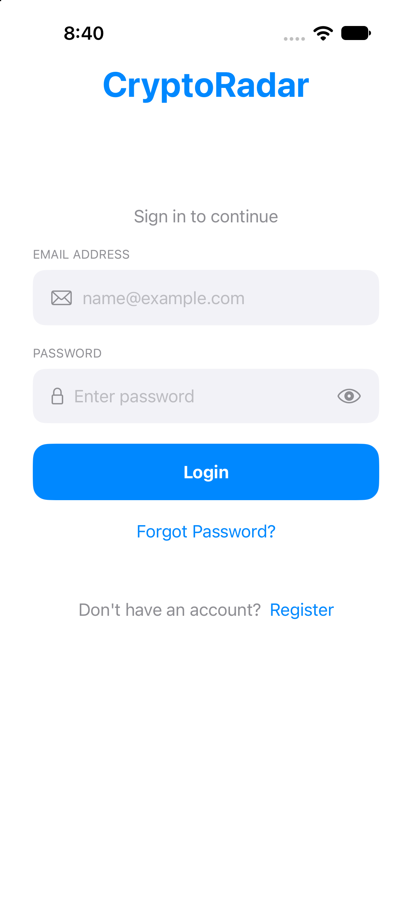
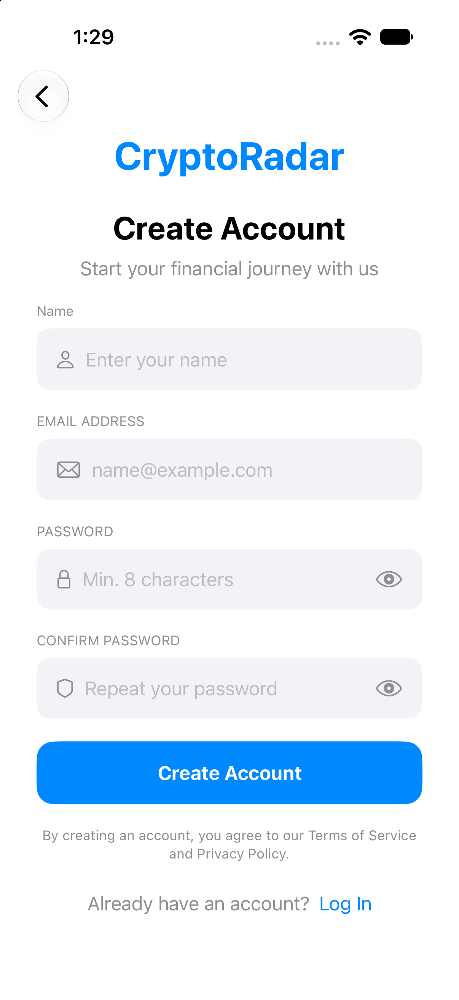
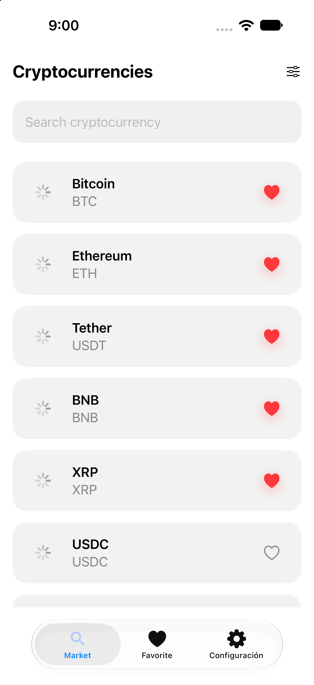
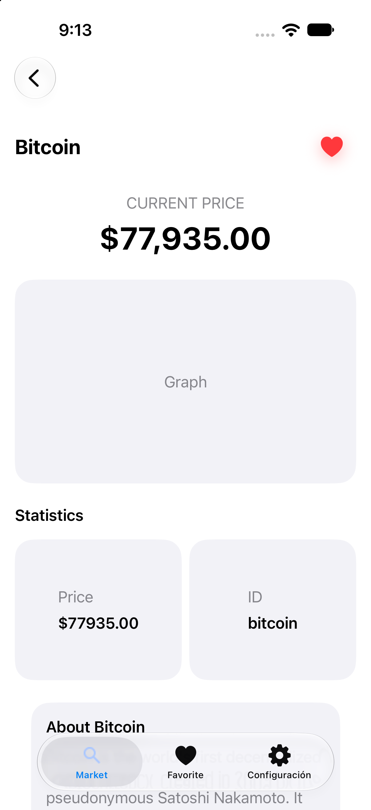
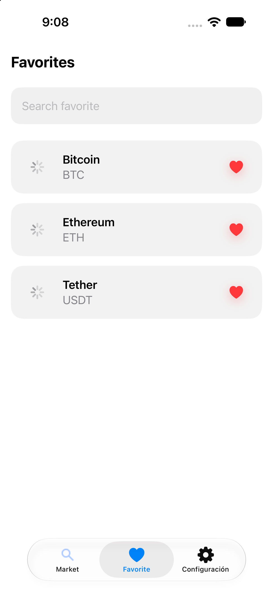
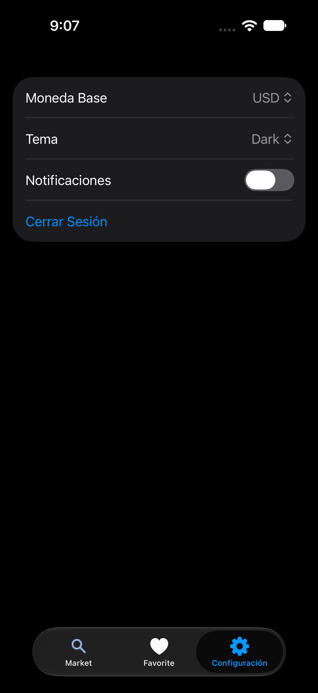

# 🚀 CryptoRadar

CryptoRadar es una aplicación iOS desarrollada en SwiftUI que permite visualizar el mercado de criptomonedas utilizando la API pública de CoinGecko.
La aplicación permite explorar criptomonedas, consultar información detallada, guardar favoritos y acceder mediante Deep Links.
---

# 📱 Funcionalidades

- Login y Registro de usuario
- Listado de criptomonedas
- Detalle de cada criptomoneda
- Agregar y eliminar favoritos
- Persistencia local mediante SwiftData
- Manejo de Keychain para autenticación
- Deep Links
- Arquitectura modular
- Inyección de dependencias mediante Swinject
---

# 📸 Screenshots

### Login

<div style="display: flex; gap: 10px;">
    
    
</div>

### Register

<div style="display: flex; gap: 10px;">
    
    
</div>

### Market

<div style="display: flex; gap: 10px;">
    
    
</div>

### Crypto Detail

<div style="display: flex; gap: 10px;">
    
    
</div>

### Favorites

<div style="display: flex; gap: 10px;">
    
    
</div>

### Settings

<div style="display: flex; gap: 10px;">
    
    
</div>

---

# 🏗 Arquitectura

El proyecto está construido siguiendo una arquitectura MVVM modular.
Cada funcionalidad está separada en módulos independientes utilizando Swift Package Manager.
La navegación se encuentra centralizada desde la aplicación principal.

Se utiliza:
- MVVM
- Dependency Injection (Swinject)
- Repository Pattern
- Networking desacoplado
- SwiftData para persistencia local
---

# 📂 Estructura del proyecto

```text
CryptoRadar
│
├── Features
│   ├── Login
│   ├── Register
│   ├── CryptoList
│   ├── CryptoDetail
│   ├── Favorite
│   └── Settings
│
├── Shared
│   ├── StorageKit
│   ├── NetworkKit
│   └── ImageKit
│
└── CryptoRadar
    ├── Sources
    ├── Resources
    └── Core
```

---

# 🔗 Deep Links

Actualmente la aplicación soporta dos accesos directos:

- Abrir detalle de Bitcoin: `cryptoradar://crypto/bitcoin`
- Abrir favoritos: `cryptoradar://favorites`

Si el usuario no ha iniciado sesión, el Deep Link queda pendiente y se ejecuta automáticamente después del Login.

### Generador de QR

Puedes generar los QR con herramientas como [short.io QR Code Generator](https://short.io/es/tools/qr-code-generator) o cualquier generador de código QR que prefieras.

### QR de ejemplo

El código QR del enlace `cryptoradar://crypto/bitcoin` es:


### QR de favoritos


> Escanea cualquiera de estos QR con la cámara del iPhone para probar que el deep link se abre correctamente dentro de la app.

### Prueba manual en iPhone

1. Genera el QR para cada deep link.
2. Escanéalo con la cámara del iPhone.
3. Verifica que la app se abre en la pantalla correcta.
4. Repite la prueba con `cryptoradar://crypto/bitcoin` y `cryptoradar://favorites`.

---

# 🛠 Stack Tecnológico

- Swift 6
- SwiftUI
- MVVM
- Swift Package Manager
- SwiftData
- Swinject
- URLSession
- CoinGecko API
- Keychain
- Deep Linking
---

# ⚙ Instalación

1. Clonar el repositorio
git clone:   https://github.com/RonaldoSwift/CryptoRadar.git
2. Abrir el proyecto en Xcode
3. Ejecutar la aplicación
---

# � Acceso de prueba

Para probar el login rápidamente, utiliza la cuenta demo de ReqRes:

- Correo: `eve.holt@reqres.in`
- Contraseña: `cityslicka`

Estas credenciales fueron verificadas contra el endpoint de login configurado en la aplicación.

---

# �👨‍💻 Autor

Ronaldo Vargas
Ingeniería de Sistemas
iOS Developer

